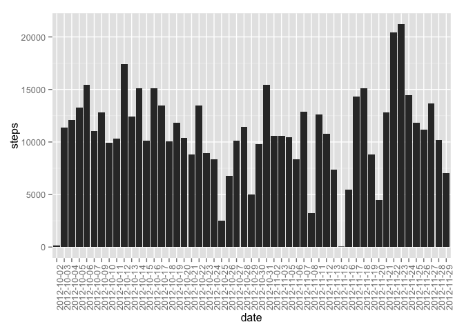
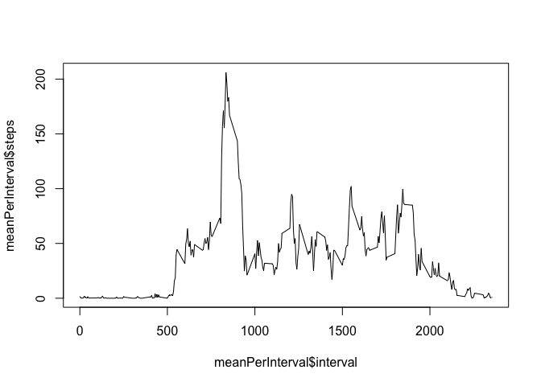
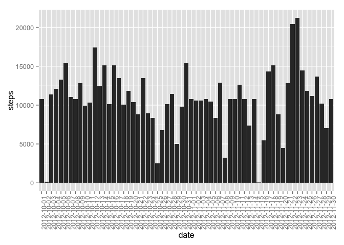
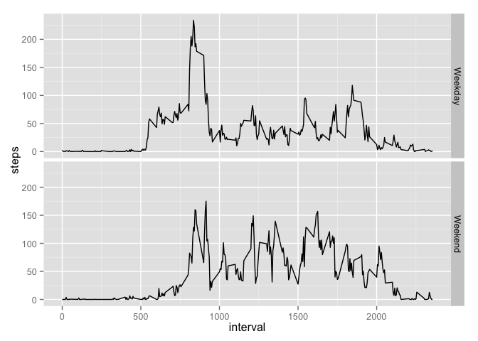

# Reproducible Research: Peer Assessment 1


## Loading and preprocessing the data
The data file is stored as `activity.zip`. First we have to unzip it using the `unzip()` function. Note we set the working directory to the git repo first. 


```r
setwd('/Users/kindaixin/Dropbox-work/Dropbox/coursera/05 Reproducible Research/PA1/RepData_PeerAssessment1')
unzip("activity.zip")
```

After unzipping the file, we will proceed to read it with `read.csv()` function. Fortunately for us, the table header is in the csv file and it is meaningful enough for interpretation.


```r
activityData <- read.csv("activity.csv")
```

Let's do a quick inspection of the data using `sample()` function


```r
activityData[sample(nrow(activityData),5),]
```

```
##       steps       date interval
## 12964     0 2012-11-15       15
## 5648    137 2012-10-20     1435
## 10919     0 2012-11-07     2150
## 3886      0 2012-10-14     1145
## 4608      0 2012-10-16     2355
```

## What is mean total number of steps taken per day?

####1. Make a histogram of the total number of steps taken each day
We will use the sum function to calculate the mean per day. All the 'na' values are removed in the calculation. We can then plot the histogram using ggplot system.

Here is the plot


```r
library(ggplot2)
sumPerDay <- aggregate(steps ~ date, data = activityData, FUN = "sum", na.rm = TRUE)
qplot(date,steps,data=sumPerDay,geom="histogram",stat="identity")+ theme(axis.text.x = element_text(angle = 90, hjust = 1))
```

 

####2. Calculate and report the mean and median total number of steps taken per day
The mean and median are:


```r
mean(sumPerDay$steps)
```

```
## [1] 10766.19
```

```r
median(sumPerDay$steps)
```

```
## [1] 10765
```

## What is the average daily activity pattern?

####1. Make a time series plot (i.e. type = "l") of the 5-minute interval (x-axis) and the average number of steps taken, averaged across all days (y-axis).

We will first get the averaged steps per interval across all days. Then we use base plot to plot the time series

```r
meanPerInterval <- aggregate(steps ~ interval, data = activityData, FUN = "mean", na.rm = TRUE)
plot(meanPerInterval$interval,meanPerInterval$steps, type="l")
```

 

####2. Which 5-minute interval, on average across all the days in the dataset, contains the maximum number of steps?
The maximum number of steps is in this 5-minute interval:


```r
meanPerInterval$interval[which.max(meanPerInterval$steps)]
```

```
## [1] 835
```


## Imputing missing values
####1.Calculate and report the total number of missing values in the dataset (i.e. the total number of rows with NAs)

The number of rows with NAs are:

```r
nrow(activityData[which(is.na(activityData$steps)),])
```

```
## [1] 2304
```

####2.Devise a strategy for filling in all of the missing values in the dataset. The strategy does not need to be sophisticated. For example, you could use the mean/median for that day, or the mean for that 5-minute interval, etc.

We will use the mean of the specific 5-minute interval to fill up the missing value. This is derived from the steps before this.


```r
mergedData <- merge(activityData,meanPerInterval,by="interval")
colnames(mergedData) <- c("interval","steps.original","date","steps.mean")

na.row <- is.na(mergedData$steps.original)
mergedData$steps.impute <- mergedData$steps.original
mergedData[na.row,]$steps.impute <- mergedData[na.row,]$steps.mean
```

####3. Create a new dataset that is equal to the original dataset but with the missing data filled in.
Create a new dataset from the mergedData with the appropriate name.


```r
activityDataImpute <- mergedData[,c("steps.impute","date","interval")]
colnames(activityDataImpute) <- c("steps","date","interval")
activityDataImpute <- activityDataImpute[order(activityDataImpute$date,activityDataImpute$interval),]
```

####4. Make a histogram of the total number of steps taken each day and Calculate and report the mean and median total number of steps taken per day. Do these values differ from the estimates from the first part of the assignment? What is the impact of imputing missing data on the estimates of the total daily number of steps?

Repeat the similar procedure of adding steps together and plotting the histogram.


```r
sumPerDayImpute <- aggregate(steps ~ date, data = activityDataImpute, FUN = "sum")
qplot(date,steps,data=sumPerDayImpute,geom="histogram",stat="identity")+ theme(axis.text.x = element_text(angle = 90, hjust = 1))
```

 

```r
mean(sumPerDayImpute$steps)
```

```
## [1] 10766.19
```

```r
median(sumPerDayImpute$steps)
```

```
## [1] 10766.19
```

The mean remains the same while the media changes. The impact of the missing data is rather minimal since the mean and media did not change much or remains the same.

## Are there differences in activity patterns between weekdays and weekends?
####1. Create a new factor variable in the dataset with two levels -- "weekday" and "weekend" indicating whether a given date is a weekday or weekend day.

We create a function to return "Weekday" or "Weekend". Then we add that column into the `activityData` data frame.

```r
getWeekdayWeekend <- function(date){
  if(weekdays(as.Date(date),abbreviate = TRUE) %in% c("Sun","Sat")){
    "Weekend"
  }
  else {
    "Weekday"
  }
}


activityData$weekend.weekday <- as.factor(sapply(activityData$date,getWeekdayWeekend))
```

####2. Make a panel plot containing a time series plot (i.e. type = "l") of the 5-minute interval (x-axis) and the average number of steps taken, averaged across all weekday days or weekend days (y-axis).


```r
avgStepByWeekendWeekday <- aggregate(steps ~ interval+weekend.weekday, data = activityData, FUN = "mean", na.rm = TRUE)
qplot(interval, steps, data=avgStepByWeekendWeekday, geom="line",facets = weekend.weekday~.)
```

 


